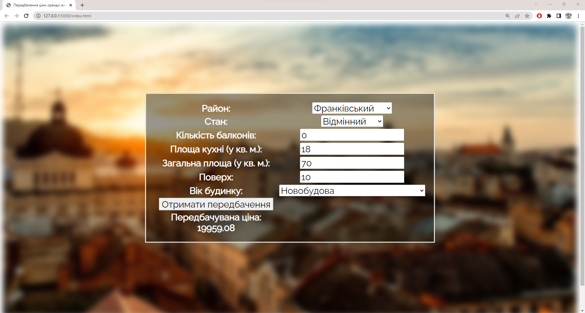

# Model for forecasting the price of renting apartments in Lviv
This repository contains a model for predicting the rental price of apartments in Lviv, Ukraine. The model is based on a dataset of apartment listings that was scraped from a popular real estate website using Selenium in Python.

## Files
- parse.py: Python script used for web scraping.
- preprocessing.ipynb: Jupyter notebook containing data cleaning and preprocessing steps.
- statistical_analysis.ipynb: Jupyter notebook containing exploratory data analysis and hypothesis testing.
- model.ipynb: Jupyter notebook containing the process of finding and evaluating regression models.

## Data
The dataset used for this model contains information on apartment listings in Lviv, including the number of rooms, the total area of the apartment, the location, and other features. The target variable is the rental price of each apartment.

## Model
The model was built using various regression algorithms including linear regression, decision tree regression, random forest regression, gradient boosting regression, and XGBoost regression. The performance of each model was evaluated using metrics such as mean absolute error, mean squared error, and R-squared.

The best performing model was a Stacking Ensamble.

## How to use
To use this model, simply clone the repository and run the Jupyter notebooks in the following order:

parse.py to scrape the latest apartment listings from the real estate website.
preprocessing.ipynb to clean and preprocess the data.
statistical_analysis.ipynb to perform exploratory data analysis and hypothesis testing.
model.ipynb to find and evaluate regression models.

## Libraries
The following libraries were used in this project:

- matplotlib
- numpy
- pandas
- scipy
- seaborn
- tensorflow
- keras
- scikit-learn
- xgboost
- plotly

## Preprocessing
The preprocessing.ipynb notebook contains the code used to clean and preprocess the data. This includes removing duplicates, handling missing values, and encoding categorical variables.

## Statistical Analysis
The statistical_analysis.ipynb notebook contains the exploratory data analysis (EDA) for the project. This includes hypothesis testing and visualizations to better understand the relationships between the variables.

## Model
The model.ipynb notebook contains the code used to train and evaluate various machine learning models for predicting the rental price of apartments in Lviv. The models used include linear regression, decision trees, random forests, support vector regression, XGBoost, and a neural network built with Keras.

## Deployed model

The ```web/``` folder in this repository contains implementation of a simple web application that predicts price using Ensemble Stacking Model.

Screenshot:


## Conclusion
Overall, this project aimed to build a model that can accurately predict the rental price of apartments in Lviv based on various features. The resulting model can be used by real estate agents, property management companies, and individuals looking to rent or invest in rental properties in Lviv.
